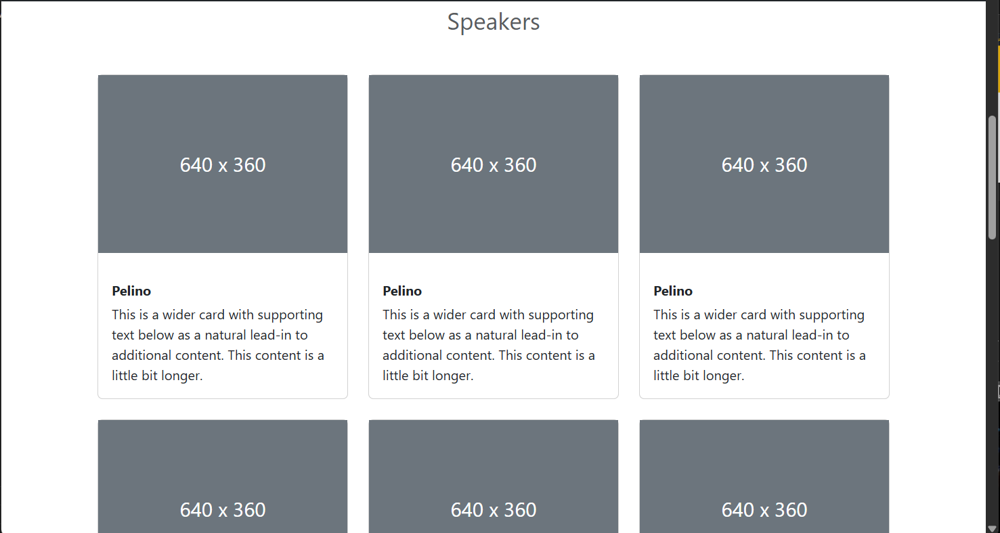

# Conference App

A fully responsive front-end web application built with **Bootstrap 5** (no custom JavaScript) that showcases a fictional tech conference — *Full Stack Conf*. This project was built as part of the Mobile Application Development course and demonstrates core skills in semantic HTML, responsive layouts, Bootstrap components, modals, and form design.

---

## Features

- **Responsive Navbar** with collapsible menu on smaller screens
- **Hero Section** with call-to-action buttons
- **Informative Sections**:
  - Expert Speakers
  - Conference Overview with image
  - What You Will Learn (tech stack table)
- **Dynamic Speaker Cards** laid out in a responsive grid
- **Interactive Schedule Table** using Bootstrap badges
- **Registration Modal** with:
  - Input fields and dropdowns
  - Topic preferences (checkboxes)
  - Payment form fields
- **Newsletter Signup** section in the footer
- **Dropdown Tracks Menu** with disabled field-style button
- Fully styled **alerts**, **badges**, and **buttons**

---

## Technologies Used

- **HTML5**
- **Bootstrap 5.3.7**
- No external/custom JavaScript used

---

## Screenshots

| Original Design (Video)
|---------------------------------------------------------------------|
|  |

| My Implementation (Screenshots)
|---------------------------------------------------------------------|
|  |                                                    
|  |                                                 
|  |                                                    
|  |                                                    
|  |                                                    
|  |                                                    

---
## How to Run

1. Clone this repository or download the HTML file.
2. Open `index.html` in any modern browser.
3. No server required — this is a static, client-side project.

---

## Project Folder Structure
| week-7-Darlington6/
├── images/
    ├──about-fullstack.jpg
├── index.html
├── project-demo.webm
├── README.md  |

---

## License

This project was created for academic purposes and is not intended for production. All image placeholders and content are fictitious and used for demonstration.

---

## Author

Desmond Tunyinko  
Mobile Application Development  
